# Outpost Dev

This is an end-to-end testing repository for the Outpost project.
The aim is to let users pull down the entire source code from various repos,
and run the project using Docker Compose.

## Getting access to the source code

This repository is just a shell script and the Docker Compose file.
It will be necessary to pull down all dependencies from their respective repos.
`setup.sh` provides this functionality.

```bash
git clone git@github.com:brian-burrows/outpost-dev.git
cd outpost-dev
chmod +x setup.sh
./setup.sh
```

Create a `.env` file similar to

```yaml
POSTGRES_USER="outpost_postgres_super_user"
POSTGRES_PASSWORD="outpost_pass"
POSTGRES_DB="outpost_weather_db"
APP_DB_USER="weather_app"
APP_DB_PASSWORD="weather_app_password"
```

## System Overview

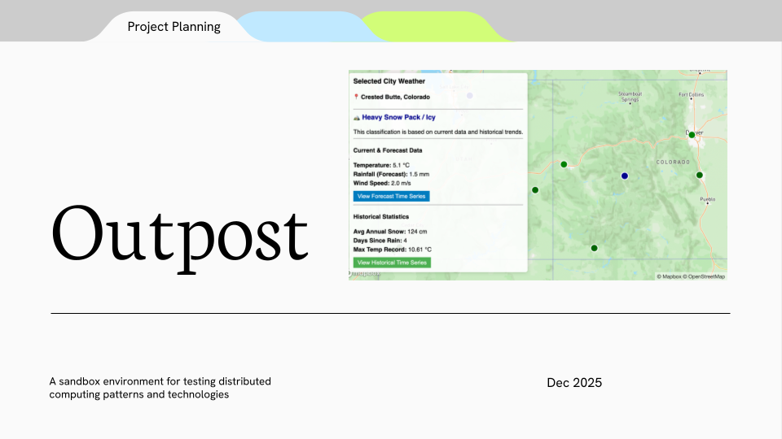

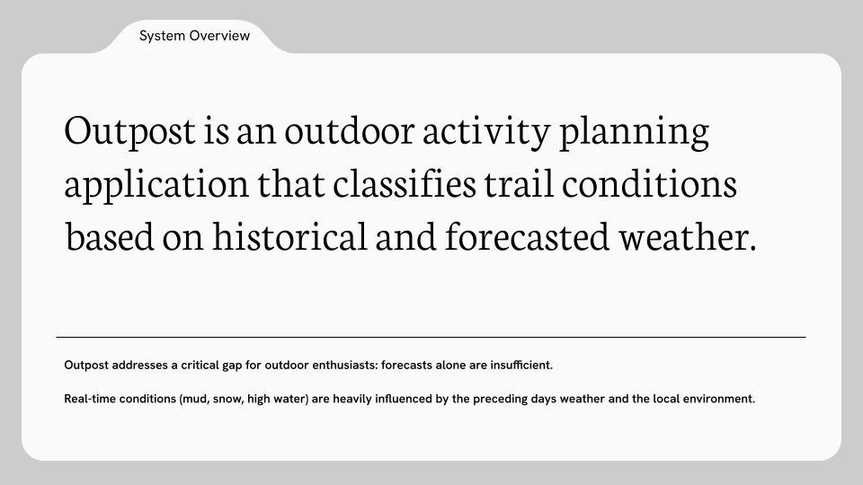

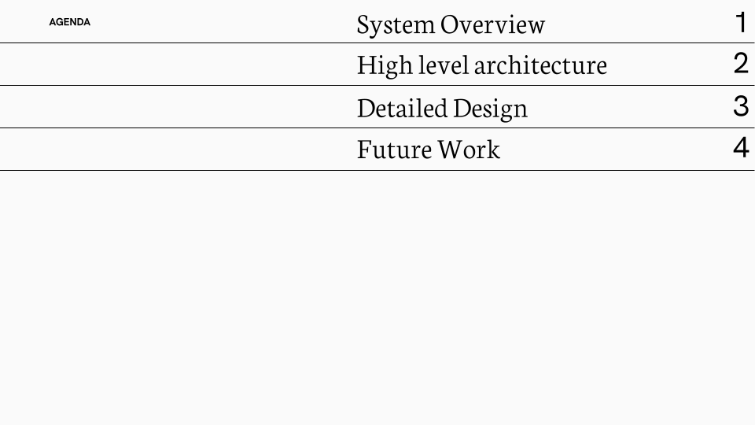

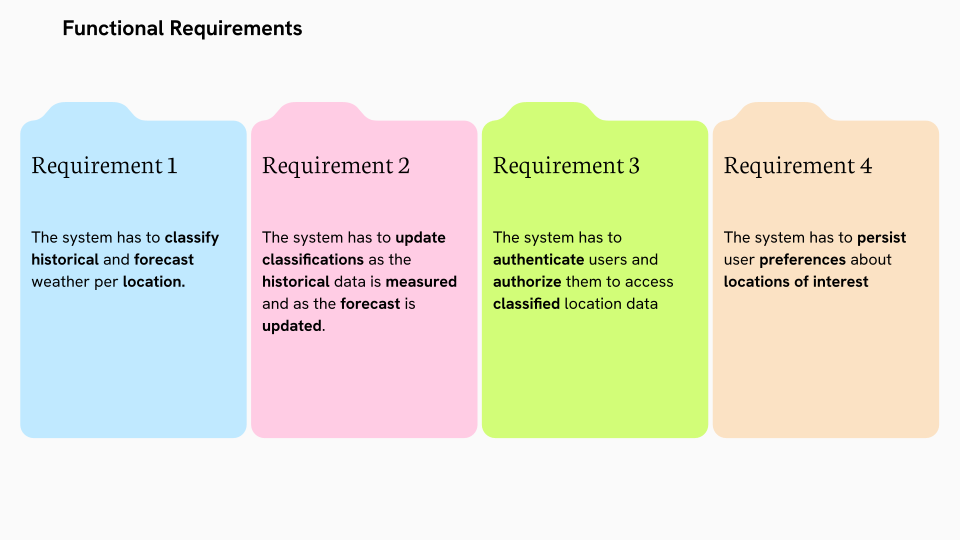

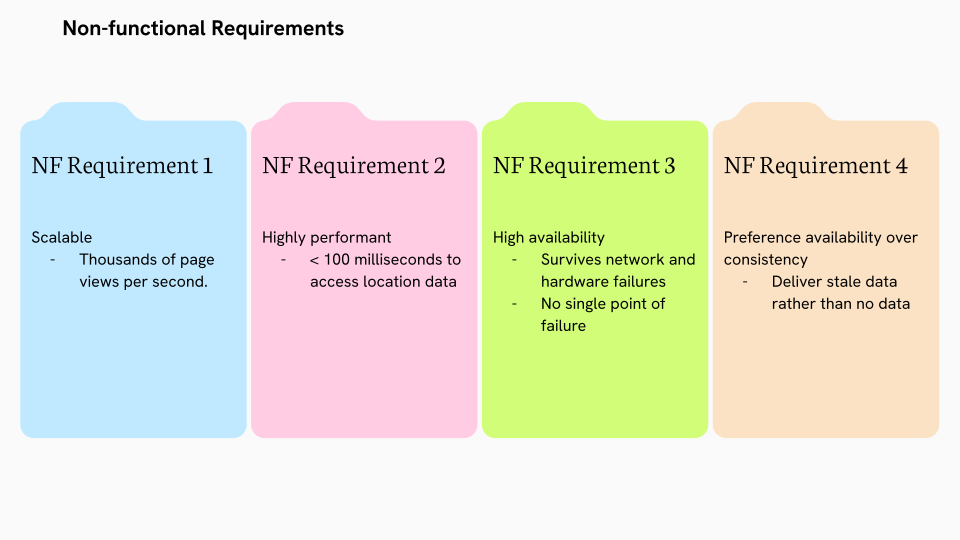

## High Level Design

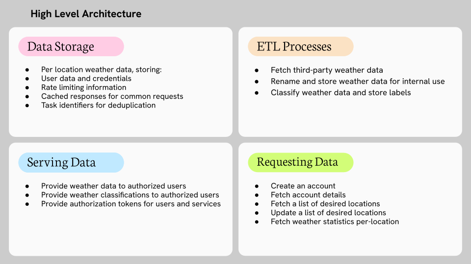

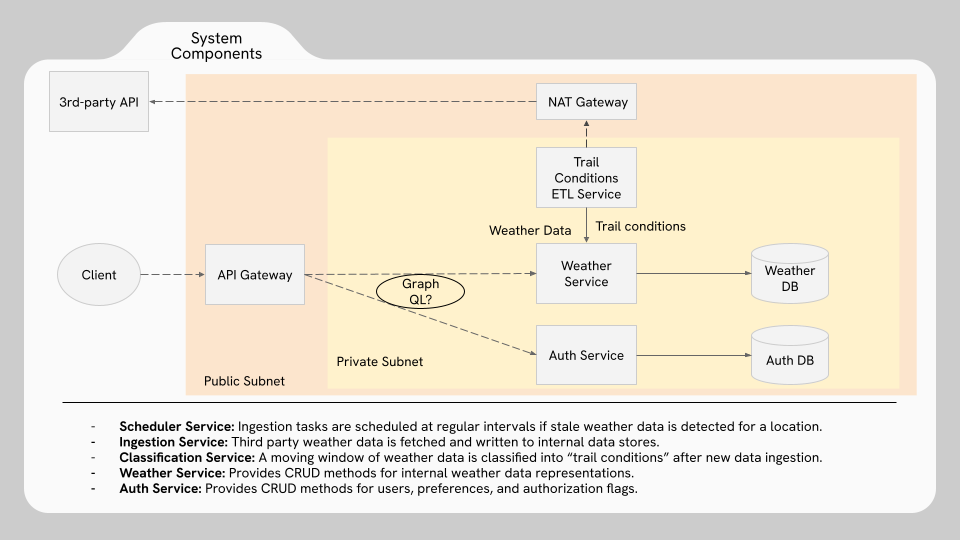

## Detailed Design

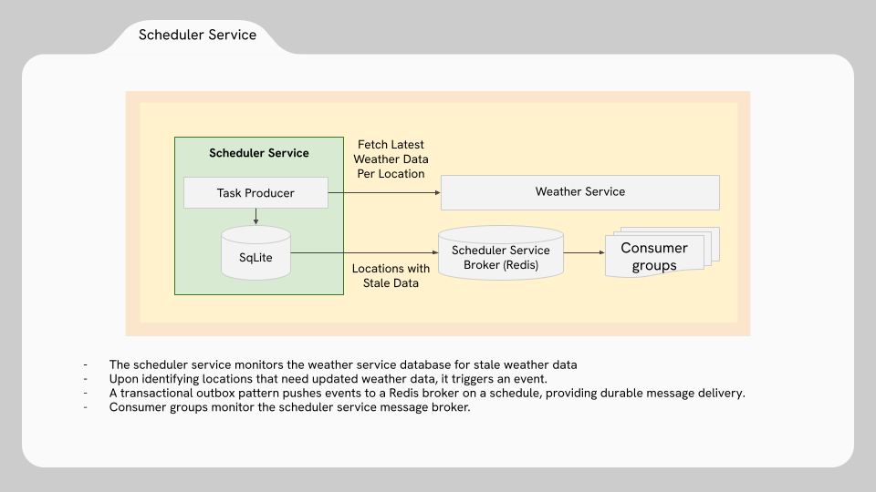

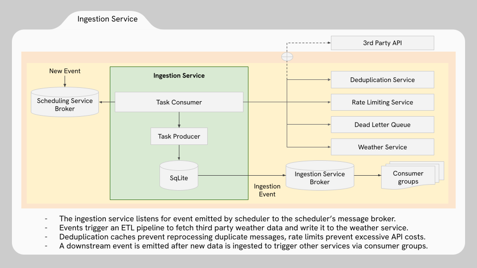

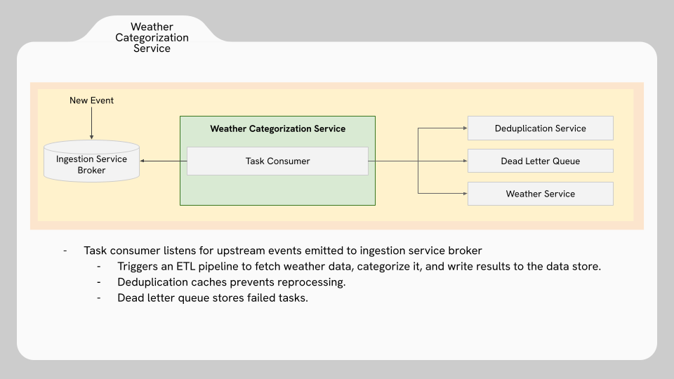

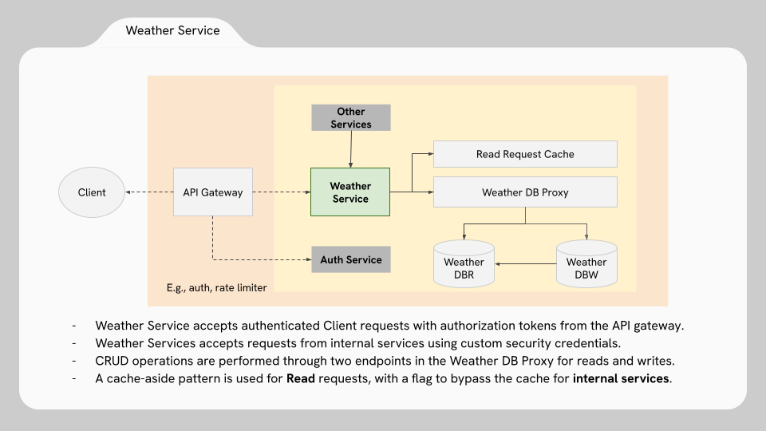

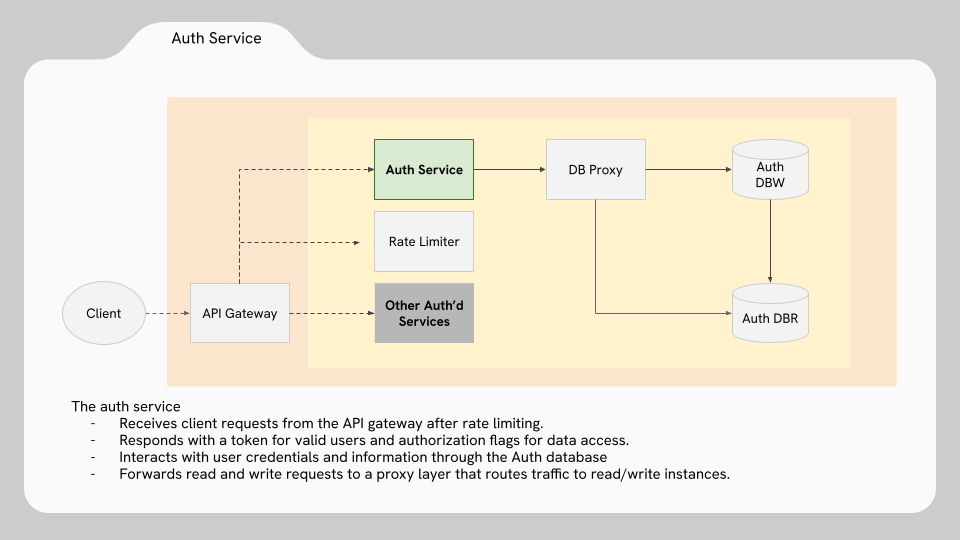

## Future Work

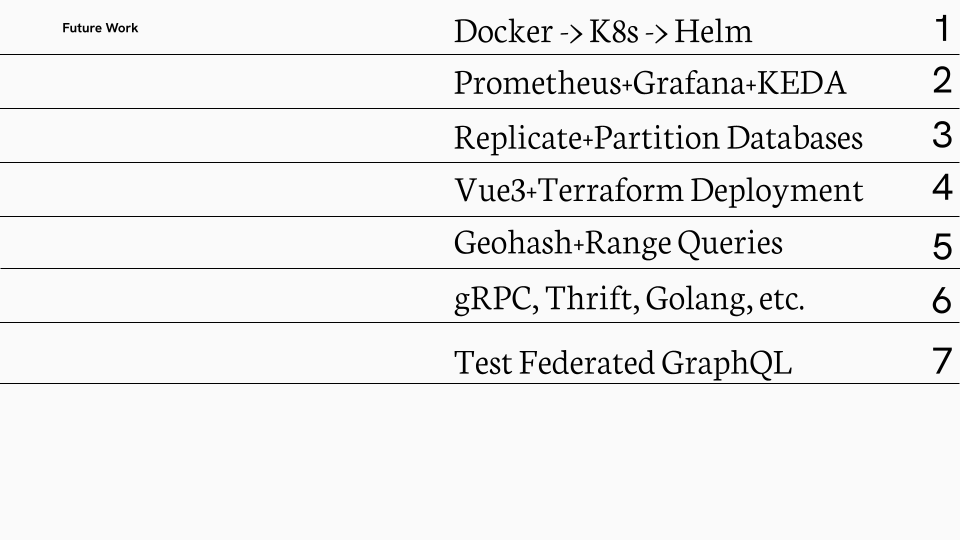
